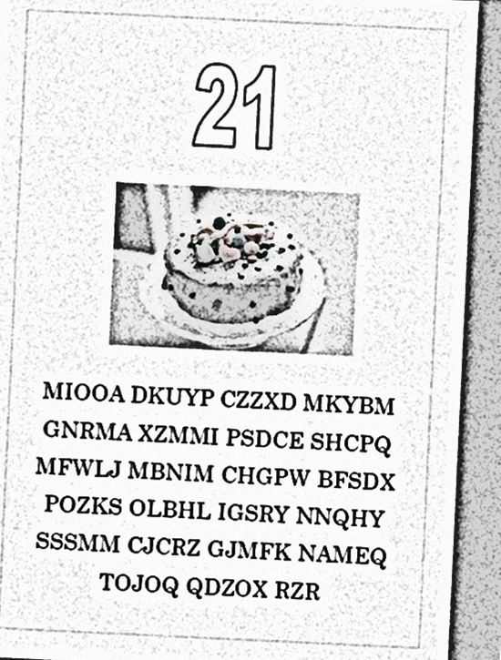

## Question A - Fizz Buzz Cipher

-----

It's Denis' 21st birthday today and he has received a mysterious birthday card with an encrypted message. 

Denis loves cryptography, and quickly identified that the message had been encrypted using the 'Fizz Buzz Cipher' - a creation of his own! Soon after making this discovery, Denis jumped to his feet and left to make a phone call.

A scan of the card has been included below. What does the encrypted text say?

#### The Fizz Buzz Cipher

To encrypt a message using the fizz buzz cipher, the following steps are taken:

1) A positive integer is chosen to be used as a 'key'.
2) The original message plaintext is written out in capital letters, omitting any numerals, spaces & punctuation.
3) A 'fizz buzz keystream' is written out to match the length (in characters) of the plaintext. To write a fizz buzz keystream, write a series of consecutive integers as would appear on a number line starting with the chosen 'key' integer, with the following exceptions:
    - Replace any integers divisible by 3 (and not 5) with "FIZZ"
    - Replace any integers divisible by 5 (and not 3) with "BUZZ"
    - Replace any integers divisible by 15 with "FIZZBUZZ"
4) Each character of the plaintext is incremented by the 'value' of the corresponding character of the keystream, to produce the ciphertext (encrypted message).
    - Digits have the same value they represent, i.e. 1 = 1
    - Letters have the value matching their 0-indexed position in the alphabet, i.e. A = 0, B = 1 ... Z = 25





Having decrypted the message, paste the plaintext into the hex-grid tool with **Question A** selected & present your pattern for verification.

For example, ```HELLOWORLD``` would be an incorrect answer, given in the correct format.