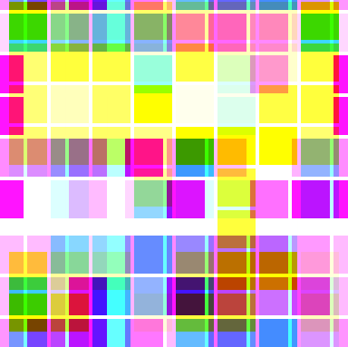

## Question C: Transposed Pixels

-----

Katie is very suspicious of cloud storage and gently obfuscates all of her images with custom software.

The software is simple and shifts the pixel values for each colour channel across the canvas to scramble images. To support this, the image canvas is treated as being joined at both sets of opposite edges or 'wrapped'. If a pixel value would be shifted outside of the original canvas, it instead continues moving from the opposite side. 

There are lots of different modes available, but Katie likes to use one called "The London" and applies it for **n** many iterations.

'The London' performs the following manipulation:
- All red channel values are moved up 2 places.
- All green channel values are moved up 2 places, then to the left 1 place.
- All blue channel values are moved up 3 places, then to the right 3 places.

```image.png``` has been obfuscated by Katie, but **n** remains unknown.

Recover the original image and present it for validation.



