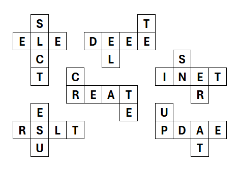
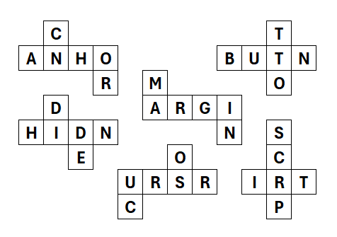

## Question D: Dice Game I

-----

One afternoon, James took it upon himself to invent a word game. His game sees two players taking turns to roll their respective sets of six dice and score words using the twelve letter faces available on the table.

As hours passed, James found himself utterly enamoured with his invention, yet at a loss as to how to assign letters to each of the dice faces. Ultimately, he resigned to simply assigning a 6-letter word to each of the dice. Surely, dice composed of English words themselves would allow a diverse range of words to be spelled. James' initial set of dice maps are pictured below.

> Words used: SELECT CREATE DELETE INSERT UPDATE RESULT



> Words used: ANCHOR BUTTON CURSOR HIDDEN MARGIN SCRIPT 



After a few turns of rolling the dice, James noted that many of his favourite words were entirely impossible to construct within the game. He found himself particularly dismayed at his inability to spell "JOIN" with the dice.

Given James' custom dictionary of words: ```CustomWordDictionary.txt```, find the number of words which cannot be spelt by using each of the 12 dice at most once (to contribute a single letter).

Enter your answer as an integer (e.g. 56) into the hex-grid tool under **Question D** & present your pattern for verification.