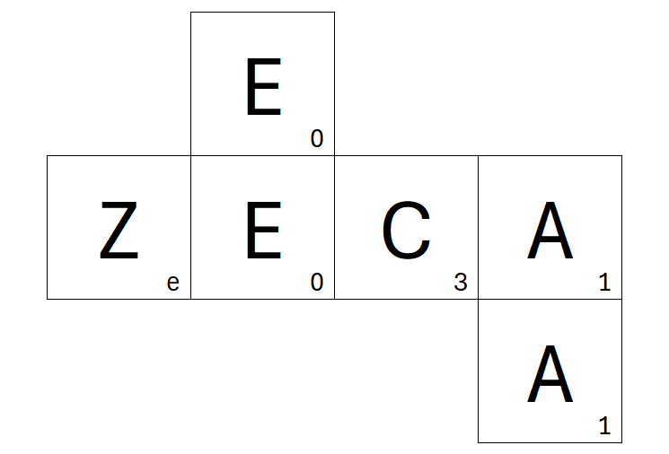

## Question E: Dice Game II

-----

Ashamed of the poor quality of his initial set of dice maps, James produced a new set of dice, using a complex algorithm to find a selection of mappings that yielded a much more comprehensive coverage of the English language.

For his revised set of dice James introduced a custom scoring scheme, commissioning special dice sets with single-digit letter scores on each face - in hexadecimal of course! Throughout each game, players score points for the words they find according to the sum of the letter scores used. The player with the most points at the end of the game wins.

Below is a glimpse of one of James' revised dice maps. Notably, E is seen to be worth 0 points.



Given this knowledge, propose a scoring scheme consistent with the dice map seen above, and both scoresheets from James & Emily's most recent game: ```Scoresheet_Emily.pdf``` & ```Scoresheet_James.pdf```.

Enter your answer as length-26 string - the scores (in hexadecimal) for each letter in alphabetical order. Paste this answer into the hex-grid tool under **Question E** & present your pattern for verification. As an example, ```a0a0a0b1b1b1b1b1c2c2c2c2c2``` is an incorrect answer given in the correct format.