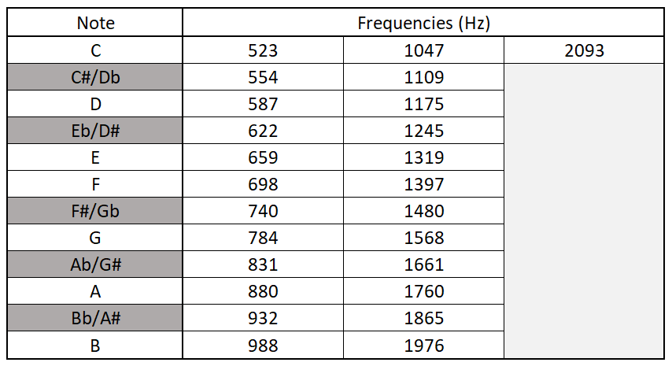

## Question F: Harmonic Forensics

-----

After many weekends of tinkering, Grace has finally finished her homemade synthesizer: a chaotic mess of wires, LEDs, speakers and chips spread across a series of breadboards. 

Elated, she reaches out and plays 4 notes at t=0 for a sustained period of 0.8 seconds.
In addition to startling the entire household, the resulting digital signal was logged to a .csv file, sampled at intervals of 0.1 ms.

Grace's synthesizer produces pure sine waves and can play each of the 25 notes in the range C5 to C7. However, to simplify the implementation process, Grace rounded the note-specific frequencies to be integers. This is shown in the reference table below.

Using this knowledge and the ```HomemadeSoundwave.csv``` log file, recover each of the 4 distinct note-frequencies of the chord Grace played.

#### Synthesizer Reference Table



#### Answer Format

Once you are confident in your answer:
1) Sort the 4 frequencies into ascending order
2) Format the integers as comma separated values, without spacing
3) Paste the resulting string into the hex-grid tool under **Question F**
4) Present your hex grid for verification

For example, ```523,554,587,2093``` is an incorrect answer given in the correct format.

