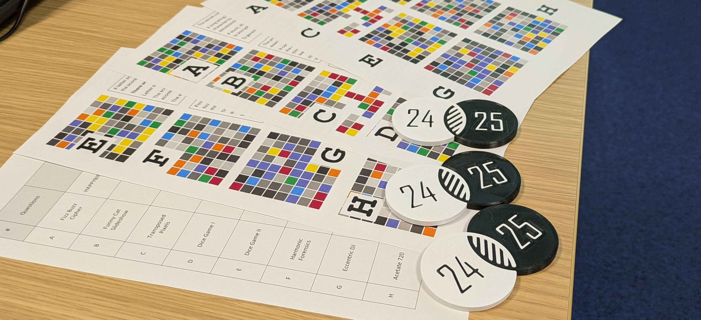

# [venn-challenge-24-25](https://eeoooue.github.io/venn-challenge-24-25/)

### Event Overview

The Venn Challenge ('24/'25) took place on May 9th, 2025.

Students competed in teams to tackle eight custom problems in an AI-collaborative setting; with express permission to use assistive tools such as GitHub Copilot, ChatGPT, Claude & Gemini.

The winning duo 'Autopilot Devs' solved 4 of the 8 problems: A, B, D & F.



### Problem Set

If you'd like to try some of the problems for yourself, download ```Problems.zip``` from the [Releases](https://github.com/eeoooue/venn-challenge-24-25/releases/tag/v1.0) page.

By generating a hash using the [hex grid tool](https://eeoooue.github.io/venn-challenge-24-25/hex_grid.html), answers can be checked against [partial validation patterns](https://eeoooue.github.io/venn-challenge-24-25/answers.html) found on the event website: [eeoooue.github.io/venn-challenge-24-25](https://eeoooue.github.io/venn-challenge-24-25/)

